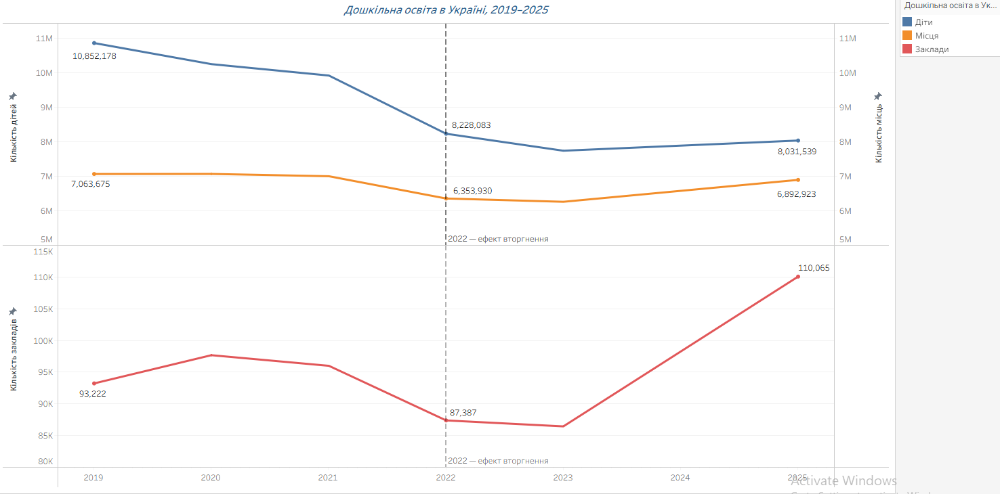
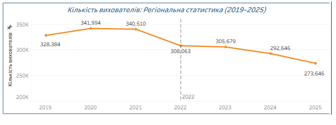
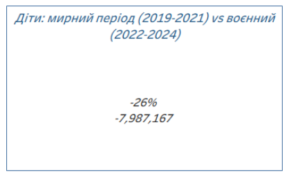
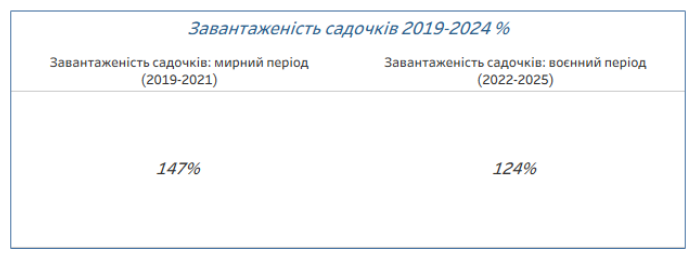
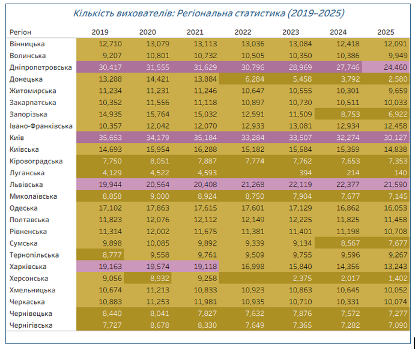

# Дошкільна освіта в Україні (2019–2025): огляд, висновки, рекомендації

Комплексне дослідження стану мережі дошкільної освіти України за 2019–2025 роки з урахуванням кадрового забезпечення (вихователів), мережі закладів, наявних місць та чисельності вихованців.

## Мета і завдання

**Мета:** проаналізувати, як повномасштабне вторгнення 2022 року вплинуло на мережу дошкільної освіти по регіонах, і на основі цього сформувати практичні рекомендації для окремих людей/сімей, організацій (дитсадків, бізнесу, громадських об'єднань) та державних органів. 

**Завдання:**
- оцінити загальну динаміку кількості дітей, місць, закладів та вихователів по Україні;
- порівняти мирний (2019–2021) і воєнний (2022–2025) періоди;
- визначити регіони з найвищим перевантаженням садочків і регіони, найбільш постраждалі від бойових дій;
- проаналізувати регіональний розподіл та скорочення кадрового складу (вихователів);
- сформувати рекомендації для держави, організацій і громадян.

## Дані та методологія

Джерело даних — Державна служба статистики України (stat.gov.ua).

Держстат публікує дані про дошкільну освіту окремими таблицями. Кожна з цих таблиць містить багато різної інформації, для дослідження зіставлено такі таблиці:

**"Кількість закладів дошкільної освіти"**
**"Кількість місць у закладах дошкільної освіти"** 
**"Кількість дітей у закладах дошкільної освіти"** 
**"Кількість вихователів у закладах дошкільної освіти"** 

**Період:** 2019–2025. 
**Одиниця аналізу:** 24 області України та м. Київ.

**Етапи підготовки даних:**
- об'єднання окремих таблиць в одну по регіону й року;
- розрахунок похідних показників — завантаженість закладів (діти/місця/вихователі), зміна рік до року, зміна мирний vs воєнний період;
- переведення таблиці в довгий формат для Tableau.

Результат — інтерактивний дашборд у Tableau:
👉 https://public.tableau.com/views/_17874211045670/Dashboard1?:language=en-GB&publish=yes&:sid=&:redirect=auth&:display_count=n&:origin=viz_share_link

# Основні результати
Проаналізовано динаміку 4 показників дошкільної освіти по 25 регіонах України (24 області + Київ) за 2019–2025 роки: кількість закладів (дитсадків), кількість місць у них, кількість вихователів та кількість дітей. Дані містять прогалини за 2022 рік для Луганської та Херсонської областей через бойові дії.

### 1. Порівняння 3-річних періодів: Мирний (2019–2021) vs Воєнний (2022–2024)

Щоб порівняння було методично точним і охоплювало однакову кількість років (по 3 роки до і після початку великої війни), було зіставлено кумулятивні показники 2019–2021 рр. та 2022–2024 рр.

Повномасштабне вторгнення 2022 року стало переломним моментом. До вторгнення (2019→2021) кількість дітей у дошкільній освіті знижувалась плавно, природним темпом — на 8,7% за два роки (з 10,85 млн до 9,91 млн). Чисельність вихователів при цьому зростала й утримувалася на стабільному рівні: 328,4 тис. осіб у 2019 р. та 340,5 тис. у 2021 р. (зростання на +3,7%). 

З початком повномасштабного вторгнення стався різкий обвал одразу по всіх чотирьох показниках:
- Місця: –12%
- Заклади: –10%
- Діти: –26,0%

- Вихователі: –10%

### 2. Динаміка 2025 року у порівнянні з 2024 роком
Окремий аналіз останнього наявного року (2025) у порівнянні з 2024 роком показує різновекторні тенденції:

- Кількість вихователів продовжила знижуватися — скорочення ще на 6,5% за рік
- Кількість закладів зросла на 32% (аномальний стрибок у звітності)
- Кількість місць зросла на 15% 
- Фактична кількість дітей зросла на 14% (аномальний стрибок у звітності)

## 3. Ключові висновки

### Позитивні тенденції

**Кадри виявилися стійкішими за відтік дітей:** 
Падіння кількості дітей (**–26%**) суттєво випередило скорочення вихователів (**–10%**).

 

**Зниження середньої завантаженості садочків** зі 147% до 124% — дещо послабило надмірне тиск на наявні місця, хоча й лишається вище норми.

 

### Проблемні аспекти

**Перевантаження окремих регіонів (2025):** 
Чернівецька (143%), Запорізька (141%), Волинська (139%), Івано-Франківська (137%), Закарпатська (135%), Дніпропетровська (134%). Це переважно захід і центр країни — регіони, що прийняли найбільше внутрішньо переміщених осіб, але не встигли пропорційно наростити інфраструктуру.

**Критичне падіння кадрового складу у прифронтових областях:**
Луганська –96,6%, Херсонська –84,5%, Донецька –80,6%, Запорізька –53,7%.

**Продовження вибуття вихователів у 2025 році:** Попри методологічний стрибок кількості закладів (+32%), чисельність вихователів у 2025 році скоротилася ще на 19 тис. осіб відносно 2024 року.
- 

**Стрибок показників у 2025 (Institutions +32%, Children +14%, Places +15%) виглядає методологічно підозріло:** 
Народжуваність в Україні у 2022–2025 роках стабільно падала (209К (2022) → 187К (2023) → 177К (2024) → 169К (2025)), тож демографічного пояснення для такого зростання немає. Ймовірніші причини: повернення переселенців у безпечніші регіони, зміна методології обліку закладів (можливе включення раніше необлікованих приватних дитсадків). **Цю аномалію варто перевірити окремо** перш ніж робити остаточні висновки.

**Співвідношення дітей на одного вихователя:** протягом війни (2022–2024) навантаження на вихователя реально покращилось — з 30,7 дитини на вихователя в мирний час до 25,4 у воєнний. Але в 2025 році це співвідношення різко підскочило назад до 29,4 — майже до довоєнного рівня. Якби заклади й діти справді зросли органічно, зросла б і кількість вихователів — натомість цього не сталось, що додатково підтверджує версію про методологічну, а не реальну природу стрибка 2025 року.

**Кадровий дефіцит і перевантаженість місць:** це різні регіональні проблеми: регіони з найгіршим співвідношенням дітей на вихователя у 2025 році (Херсонська, Київська, Хмельницька, Харківська) — це не ті самі регіони, що перевантажені за кількістю місць (Чернівецька, Запорізька, Волинська, Івано-Франківська, Закарпатська, Дніпропетровська). У самих перевантажених за місцями регіонах співвідношення дітей на вихователя за 2019–2025 переважно навіть покращилось. Тобто дефіцит місць і дефіцит кадрів потребують різних рішень і в різних областях.

### Що покращити (пріоритети)

1. Насамперед — **розібратись у причині стрибка 2025 року, зокрема чому заклади зросли (+32%) значно швидше за дітей (+14%).**
2. Направити ресурси на регіони з найвищим перевантаженням (Чернівецька, Запорізька, Волинська, Івано-Франківська, Закарпатська) — саме там зараз найгостріший дефіцит місць відносно попиту.

## 3. Рекомендації 

### Окрема людина / сім'я

- Якщо в районі немає вільних місць у дитсадку — розглянути **відкриття власного невеликого приватного дитсадка чи домашньої групи.**
- Шукати місце **не лише в закладах свого мікрорайону**, а й у сусідніх.
- Об'єднуватись з іншими батьками для спільного найму приватного вихователя на кілька родин.

### Організації (дитсадки, громадські об'єднання, бізнес)

- **Завчасно прогнозувати дефіцит персоналу та місць**, спираючись на дані соціальних служб про кількість новонароджених/зареєстрованих дітей у районі на 2–3 роки вперед.
- Розглядати **розширювати існуючу інфраструктуру**, (прибудови, використання вільних приміщень) замість будівництва нових об'єктів.
- **Перепланування наявних приміщень** — оптимізувати внутрішній простір та впроваджувати групи неповного дня чи змінний графік.
- Розвивати корпоративні дитячі садки/ дитячі кімнати/ групи на базі підприємств.

### Державні органи

- **Будівництво нових закладів у регіонах з найвищим перевантаженням**, а не рівномірно по всій країні.
- **Підвищення оплати праці вихователям** — для утримання кадрів і залучення нових.
- **Спрощені програми та гранти для відкриття приватних дитсадків** — знизити бюрократичні бар'єри й дати фінансову підтримку малому бізнесу в цій сфері.
- **Перегляд і уніфікація методології обліку** закладів дошкільної освіти для усунення статистичних аномалій.
- **Цільова програма для регіонів з великою кількістю ВПО (внутрішньо переміщених осіб)** — компенсаційне фінансування для регіонів, що прийняли значний приплив переселенців, але не отримали збільшення бюджету.
- **Публікація регулярних відкритих звітів** про завантаженість закладів по регіонах — щоб і батьки, і аналітики могли відстежувати ситуацію в реальному часі.

---

*Джерело даних: Державна служба статистики України (stat.gov.ua). Аналіз охоплює 2019–2025 роки, 25 регіонів. Дані за 2022 рік для Луганської та Херсонської областей відсутні через бойові дії.*

