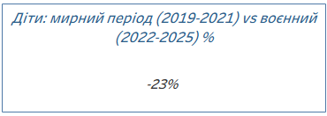
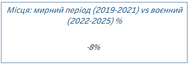
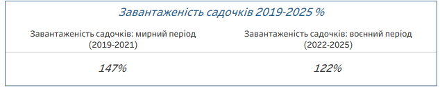
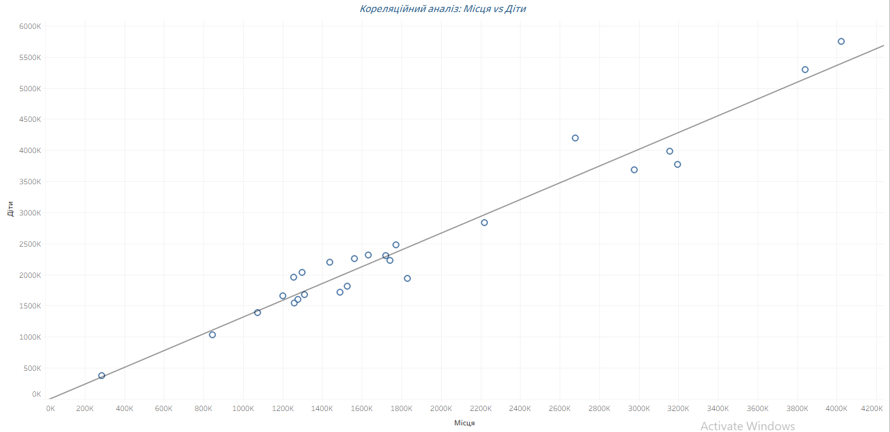
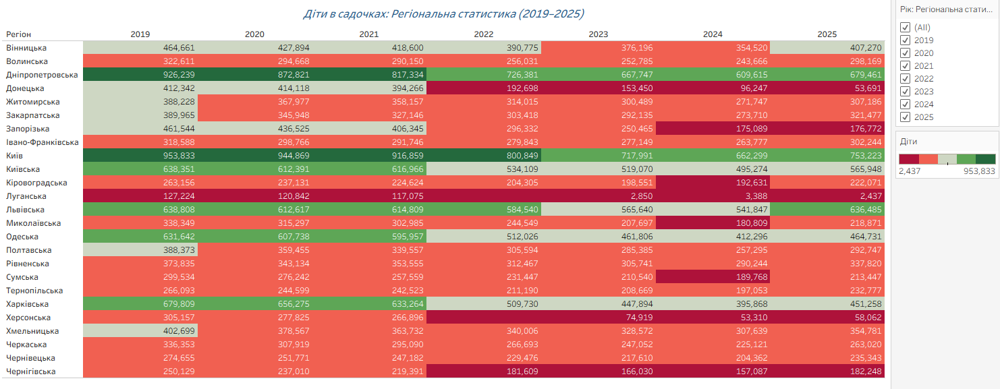

# Дошкільна освіта в Україні (2019–2025): огляд, висновки, рекомендації

## Як зроблено це дослідження

Держстат публікує дані про дошкільну освіту окремими таблицями. Кожна з цих таблиць містить багато різної інформації, але для аналізу я витягнула із кожної лише те, що потрібно: регіон, рік і саме число (кількість закладів / місць / дітей). Для цього дослідження я свідомо обрала й зіставила три такі таблиці, щоб побачити зв'язок між ними, а не дивитись на кожен показник окремо:

- **"Кількість закладів дошкільної освіти"** — скільки дитсадків працює в кожному регіоні;
- **"Кількість місць у закладах дошкільної освіти"** — на скільки дітей розраховані ці заклади;
- **"Кількість дітей у закладах дошкільної освіти"** — скільки дітей туди фактично ходить.

Далі всі три відібрані набори об'єднано в один (по регіону й року), і вже на об'єднаних даних порахована статистика: хронологічні зміни, показники переповненості, найбільш постраждалі регіони та сукупну кореляцію.

Результат — інтерактивний дашборд у Tableau, де кожен графік і карта побудовані саме на цих об'єднаних даних:
👉 https://public.tableau.com/views/_17874211045670/Dashboard1?:language=en-GB&publish=yes&:sid=&:redirect=auth&:display_count=n&:origin=viz_share_link

Нижче наведено основні аналітичні висновки та прикладні рекомендації для трьох рівнів: людини, організації та держави.

## 1. Огляд

Проаналізовано динаміку трьох показників дошкільної освіти по 25 регіонах України (24 області + Київ) за 2019–2025 роки: кількість закладів (дитсадків), кількість місць у них та кількість дітей, які їх відвідують. Дані містять прогалини за 2022 рік для Луганської та Херсонської областей через бойові дії.

Повномасштабне вторгнення 2022 року стало переломним моментом. До вторгнення (2019→2021) кількість дітей у дошкільній освіті знижувалась плавно, природним темпом — на 8,7% за два роки (з 10,85 млн до 9,91 млн). А вже за один рік, 2021→2022, стався різкий обвал одразу по всіх трьох показниках: діти –17,0%, місця –9,2%, заклади –9,0%. Удар позначився на всій системі одночасно, хоча кількість дітей скорочувалася швидше за інфраструктуру.

## 2. Ключові висновки

### Позитивні тенденції

- **Заклади й місця виявились стійкішими за дітей:** 
Порівняння мирного (2019–2021) і воєнного (2022–2025) періодів: діти –23%, місця –8%. Інфраструктура дошкільної освіти не "схлопнулась" разом із падінням кількості дітей — мережа переважно збереглась.
*(KPI-картки  і )*.

- **Зниження середньої завантаженості садочків** зі 147% (мирний період) до 122% (воєнний) — тобто тиск на наявні місця дещо послабшав, хоча й лишається вище норми.
*(KPI-картка )* 

- **Кореляція між кількістю місць і кількістю дітей залишається сильною** — на графіку «Кореляційний аналіз: Місця vs Діти» майже всі 25 регіонів лягають вздовж однієї прямої лінії. Система в цілому логічна й пропорційна, попри війну.
*(графік )

### Проблемні аспекти

- **Структурний дефіцит місць.** 
Навіть у 2025 завантаженість становить 122% в середньому по країні, а в окремих регіонах значно вище.

- **Найгірші регіони за перевантаженням садочків (2025):** 
Чернівецька (143%), Запорізька (141%), Волинська (139%), Івано-Франківська (137%), Закарпатська (135%), Дніпропетровська (134%). Це переважно захід і центр країни — регіони, що прийняли найбільше внутрішньо переміщених осіб, але не встигли пропорційно наростити інфраструктуру.

- **Найбільш постраждалі від бойових дій регіони (2025):**  
Луганська (пропущені дані 2022, різкий обвал — з 127К дітей у 2019 до ~2,4К у 2025), Херсонська (аналогічно), Донецька і Запорізька (стабільне щорічне скорочення закладів і дітей через бойові дії й окупацію). На тренд-графіку «Дошкільна освіта в Україні, 2019–2025» цей обвал видно по всій країні одразу після позначки 2022 — ефект вторгнення.
*()
*()*

- **Стрибок показників у 2025 (Institutions +32%, Children +14%, Places +15%) виглядає методологічно підозріло:** 
Народжуваність в Україні у 2022–2025 роках стабільно падала (209К (2022) → 187К (2023) → 177К (2024) → 169К (2025)), тож демографічного пояснення для такого зростання немає. Ймовірніші причини: повернення переселенців у безпечніші регіони, зміна методології обліку закладів (можливе включення раніше необлікованих приватних дитсадків). **Цю аномалію варто перевірити окремо** перш ніж робити остаточні висновки.

### Що покращити (пріоритети)

1. Насамперед — **розібратись у причині стрибка 2025 року, зокрема чому заклади зросли (+32%) значно швидше за дітей (+14%).**
2. Направити ресурси на регіони з найвищим перевантаженням (Чернівецька, Запорізька, Волинська, Івано-Франківська, Закарпатська) — саме там зараз найгостріший дефіцит місць відносно попиту.

## 3. Рекомендації 

### Рівень 1 — Окрема людина / сім'я

- Якщо в районі немає вільних місць у дитсадку — розглянути **відкриття власного невеликого приватного дитсадка чи домашньої групи.**
- Шукати місце **не лише в закладах свого мікрорайону**, а й у сусідніх.
- Об'єднуватись з іншими батьками для спільного найму приватного вихователя на кілька родин.

### Рівень 2 — Організації (дитсадки, громадські об'єднання, бізнес)

- **Завчасно прогнозувати дефіцит персоналу та місць**, спираючись на дані соціальних служб про кількість новонароджених/зареєстрованих дітей у районі на 2–3 роки вперед.
- Розглядати **розширювати існуючу інфраструктуру**, (прибудови, використання вільних приміщень) замість будівництва нових об'єктів.
- **Перепланування наявних приміщень** — оптимізувати внутрішній простір та впроваджувати групи неповного дня чи змінний графік.
- Розвивати корпоративні дитячі садки/ дитячі кімнати/ групи на базі підприємств.

### Рівень 3 — Державні органи

- **Будівництво нових закладів у регіонах з найвищим перевантаженням**, а не рівномірно по всій країні.
- **Підвищення оплати праці вихователям** — для утримання кадрів і залучення нових.
- **Спрощені програми та гранти для відкриття приватних дитсадків** — знизити бюрократичні бар'єри й дати фінансову підтримку малому бізнесу в цій сфері.
- **Перегляд і уніфікація методології обліку** закладів дошкільної освіти для усунення статистичних аномалій.
- **Цільова програма для регіонів з великою кількістю ВПО (внутрішньо переміщених осіб)** — компенсаційне фінансування для регіонів, що прийняли значний приплив переселенців, але не отримали збільшення бюджету.
- **Публікація регулярних відкритих звітів** про завантаженість закладів по регіонах — щоб і батьки, і аналітики могли відстежувати ситуацію в реальному часі.

---

*Джерело даних: Державна служба статистики України (stat.gov.ua). Аналіз охоплює 2019–2025 роки, 25 регіонів. Дані за 2022 рік для Луганської та Херсонської областей відсутні через бойові дії.*

